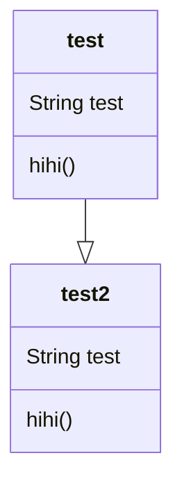

# Documentation

## Client

```mermaid
classDiagram

test --|> test2


    class test{
        String test
        hihi()
    }
    class test2{
        String test
        hihi()
    }
```

## Broker
